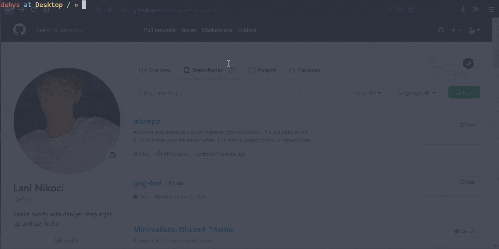

# mkrepo script

 
  

*This is a bash script made to make life easier when it comes down to creating a new GitHub repository. With 1 command you get a remote repository on Github, whether that would be on your Github account or a Github organization that you are a member of. And a local copy of it. Note that the script is still in development and as of right now, error handling and help commands are non-existent.*

Made with :heart: by <a href="https://github.com/dehys" target="_blank">dehys</a>
